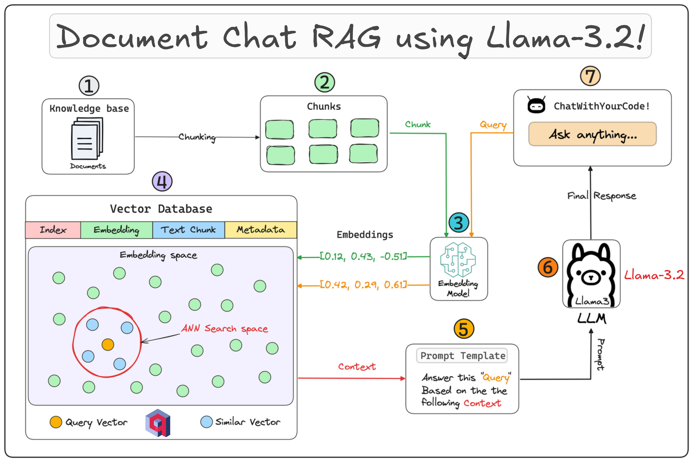

# 🔍MARIA: Metering Analysis and Retrieval Information Assistant
**Version**: 1.0 \
**Author**: Piyapart Buttamart \
**Created Date**: November 20, 2024

MARIA is a locally hosted Retrieval-Augmented Generation (RAG) application designed for efficient technical data retrieval and summarization from equipment manuals and controlled documents. This repository includes tools for creating embeddings (```embedding.py```), a command-line interface (```MARIA1.py```), and a web-based application (```app.py```) built with Streamlit.
<figure style="text-align: center;">
  
  <figcaption><b>Figure 1:</b> Workflow of Document Chat RAG using Llama-3
  </figcaption>
</figure>


## Features
- **Local Processing**: All data operations are performed locally to ensure privacy and security.
- **Embeddings Generation**: Converts document pages into vectorized data for similarity-based retrieval.
- **Command-Line and Interactive Tools**: Supports both CLI and Streamlit-based interfaces.
- **Contextual Summarization**: Generates concise answers with proper references to source materials.

## Installation
1. **Python**\
    Download and install the latest version of Python from the [official Python website](https://www.python.org/). Make sure to check the box that says "Add Python to PATH" before clicking "Install Now". To verify that the Python is successfully installed, open Command Prompt (Windows) or Terminal (macOS) and type:
    ```bash
    python --version
    ```
    Also, verify that ```pip``` is installed by typing ```pip --version``` in your Command Prompt or Terminal.

2. **Python Libraries**\
    Install the required Python library by navigate the Command Prompt (Windows) or Terminal (macOS) to the current path and type:
    ```bash
    pip install -r requirements.txt
    ```

3. **Ollama**\
    Download and install the latest version of Ollama from the [official Ollama website](https://ollama.com/download). To verify that Ollama is successfully installed, open Command Prompt (Windows) or Terminal (macOS) and type:
    ```bash
    ollama --version
    ```
4. **Llama3.2**\
    Download and install the latest version of Llama3.2 from the [official llama3.2 website](https://ollama.com/library/llama3.2). To verify that llama3.2 is successfully installed, open Command Prompt (Windows) or Terminal (macOS) and type:
    ```bash
    ollama list
    ```
    "You can also verify the model installation by checking the directory ```C:\Users\<user>\.ollama\models\blobs```

## Usage
1. **Generate Vectorstore** \
    After including all relevant PDFs in the ```documents/``` folder, run ```embedding.py``` to process PDFs and create a vectorstore file (```vectorstore/vectorstore.pkl```):
    ```bash
    python embedding.py
    ```
    This script extracts text from each page of the PDFs, split into chunks and convert into vector representations using ```sentence-transformers/all-MiniLM-L6-v2```.

    **Note**: 
    1. This script is required to run every time the PDF files is updated (add new files or removed).
    2. Ensure the documents are in PDF format and contain machine-readable text (not scanned images).

2. **Interactive Web App**\
    To activate the web app, run the streamlit app with ```app.py```:
    ```bash
    streamlit run app.py
    ```
    The web app provides a user-friendly interface for querying and interacting with the document knowledge base.

## Workflow Overview
1. Embedding Phase (```embedding.py```):
- PDFs → Text → Embeddings → Vectorstore.

2. Retrieval Phase:
- Queries → Similarity Search → Relevant Chunks.

3. Answer Generation:
- Retrieved Chunks → LLM → Final Response with Sources.

## Example Queries
Use these queries to test MARIA:
- *Explain the purposes of signal converter, signal processor and microprocessor in ZMQ meter?*
- *Provide step-by-step instructions to change the password on an ION8800 meter.*
- "How is reactive energy allocated to four quadrants in the ZMQ system? ?"

## Notes
- The embedding process may take time depending on the size and number of PDFs in ```documents/```.
- Ensure a GPU-enabled environment for faster embeddings, if available.
- Use the same vectorstore file across all tools for consistency.

## Future Enhancements
- Enable support for image and table extraction.
- Add multi-language support for broader applicability.
- Optimize retrieval for large-scale document sets.